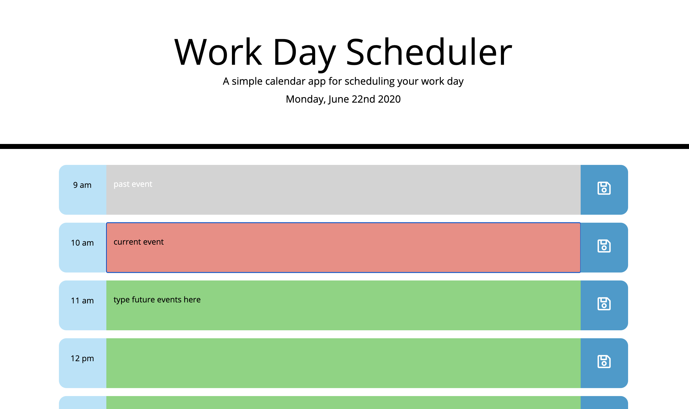

# Work-Day-Scheduler

## Description and Usage
This is a simple day planner application for business employees to better organize their work days. Upon entering the applicaton, user will see work day hours divided into time blocks. Users will be able to type in events of the day into these time blocks under corresponding hours. The time blocks will show three different colors, grey (meaning the event has passed), red (meaning the event is current), and green (meaning it is a future event). If user chooses to save an event, the saved event will persist when the user closes the window and reopens it in a future time.

## Link to Application
https://dilanli.github.io/Work-Day-Scheduler/

## Display/ Interface
This is meant to be a browser based app. The target devices for this application are office desktops or laptops. 

## Developing Process
- The application tracks time and date dynamically by using the moment.js library.
- Data attributes are given to each hour to match with current hour in moment.js library, this will determine if an event is past, current, or future.
- All local storage will be wiped out if the "Clear All Events" button is clicked.